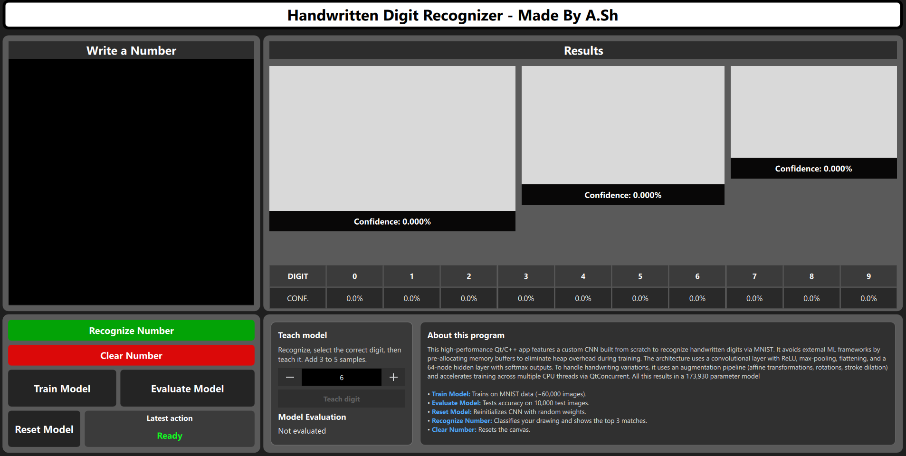

# Handwritten Digit Recognizer

A desktop application built with **Qt 6 (C++ & QML)** that recognizes handwritten 
digits using Convolutional Neural Network (CNN) with 16 filters. The application uses the Mnist datset 
for training as well as for testing 

The architecture begins with a 28 by 28 pixel input layer expecting normalized values 
in the [0, 1] range, passing into a convolutional layer equipped with configurable 
filters, small positive biases to prevent dead ReLUs, and ReLU activation. This is 
followed by a 2x2 max pooling layer that feeds into a flattening layer to serialize 
the feature maps into a 1D vector. The flattened data then flows through a dense 
hidden layer utilizing ReLU activation and a 10-neuron output layer featuring stable 
softmax probabilities for digit classification from 0 to 9. Finally, the network is 
trained using gradient descent with L2 regularization, multithreaded batch processing 
via QtConcurrent, and robust data augmentation techniques including spatial shifts, 
rotations, scaling, and stroke dilation.

## Motivation 
This is my second program made using Qt. For that reason, I wanted something simple 
yet challenging, with the intention of learning more about the framework as well as 
machine learning. Driven by a deep interest in neural networks and how machines learn,
I chose to build this project entirely from scratch without relying on any external 
machine learning libraries.

## Features
* Real-time digit drawing canvas.
* Model Control & Actions: Interactive buttons to perform primary operations, including:
    * Recognize Number: Classifies the user's drawing and displays the top matches.
    * Clear Number: Resets the drawing canvas.
    * Train Model: Trains the system on MNIST data (~60,000 images).
    * Evaluate Model: Tests accuracy on 10,000 test images.
    * Reset Model: Reinitializes the CNN with random weights.
* Top Recognition Results: Visual display panels showing the top matching predictions along with their confidence percentages.
* Digit Confidence Breakdown Table: A comprehensive table listing digits from 0 to 9 alongside their individual confidence levels (CONF)
* Teaching/Interactive Training Module: A "Teach model" feature that allows users to recognize a drawing, select the correct digit label 
via a numeric selector, and add custom samples (3 to 5 samples)



## Getting Started

### Prerequisites
* **Qt 6.x** (MinGW 64-bit or MSVC compiler kit)
* **CMake** (version 3.16 or higher)

### Building and Running
1. Clone the repository:
   ```bash
   git clone [https://github.com/your-username/HandwrittenDigitRecognizer.git](https://github.com/your-username/HandwrittenDigitRecognizer.git)