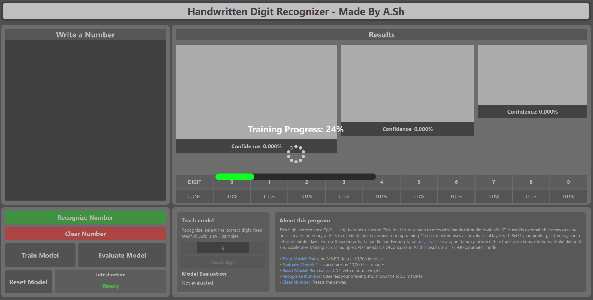
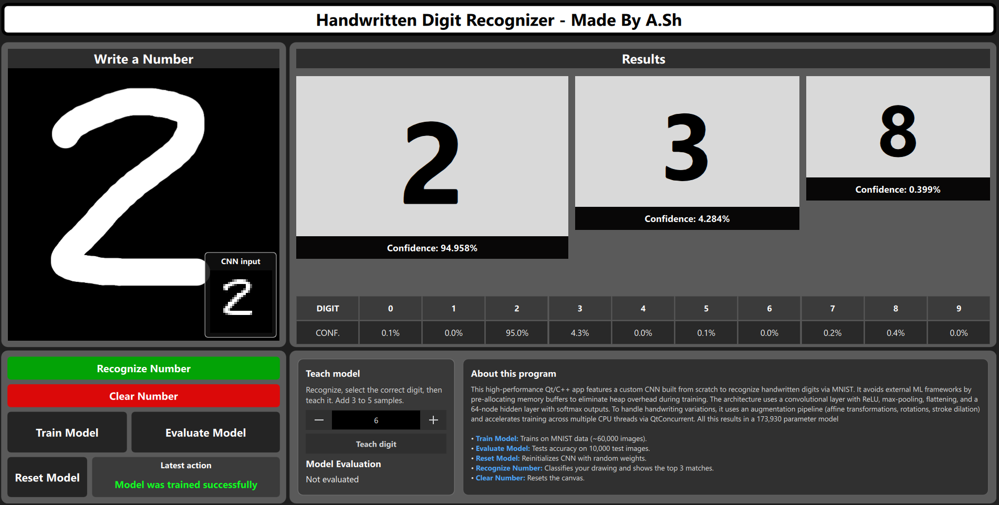

# Handwritten Digit Recognizer

A desktop application built with **Qt 6 (C++ & QML)** that recognizes handwritten 
digits using Convolutional Neural Network (CNN) with 16 filters. The application uses the Mnist datset 
for training as well as for testing 

## Motivation 
This is my second program made using Qt. For that reason, I wanted something simple 
yet challenging, with the intention of learning more about the framework as well as 
machine learning. Driven by a deep interest in neural networks and how machines learn,
I chose to build this project entirely from scratch without relying on any external 
machine learning libraries.

## Features
* Real-time digit drawing canvas.
* Model Control & Actions: Interactive buttons to perform primary operations, including:
    * Recognize Number: Classifies the user's drawing and displays the top matches.
    * Clear Number: Resets the drawing canvas.
    * Train Model: Trains the system on MNIST data (~60,000 images).
    * Evaluate Model: Tests accuracy on 10,000 test images.
    * Reset Model: Reinitializes the CNN with random weights.
* Top Recognition Results: Visual display panels showing the top matching predictions along with their confidence percentages.
* Digit Confidence Breakdown Table: A comprehensive table listing digits from 0 to 9 alongside their individual confidence levels (CONF)
* Teaching/Interactive Training Module: A "Teach model" feature that allows users to recognize a drawing, select the correct digit label 
via a numeric selector, and add custom samples (3 to 5 samples)

## Getting Started

### Prerequisites
* **Qt 6.x** (MinGW 64-bit or MSVC compiler kit)
* **CMake** (version 3.16 or higher)

### Building and Running
1. **Clone the repository** or open the project folder in **Qt Creator**.
2. **Configure the project** by selecting your preferred Qt 6 kit (e.g., MinGW or MSVC) when prompted by CMake.
3. **Build the project** by clicking the **Build** button (or pressing `Ctrl+B`).
4. **Run the application** by clicking the **Run** button (or pressing `Ctrl+R`) to launch the user interface.

---

## Architecture

The project consists of three main files.
* **AppManager** handles user inputs like drawing, training, and evaluation, processes the image data, and connects the neural network backend to the QML frontend.
* **DatasetLoader** manages the dataset.
* **NeuralNetwork** implements the neural network functionality.

### 1. Forward Pass Pipeline

#### Canvas Drawing & Image Preprocessing
Before data enters the network, users interact with an intuitive QML drawing interface built using a responsive `Canvas` component. As a user writes a number with the mouse, stroke points are tracked, scaled, and dynamically rendered with smooth, rounded lines against a solid background. When a prediction is triggered, the canvas captures the drawn area into an image buffer via `grabToImage`, passing the raw texture data straight to the backend manager to format it into the correct uniform input contract.

#### Input Handling & Normalization
When an image is passed into the network, the system begins by clamping the pixel values into a uniform range and organizing them into a structured two-dimensional grid. This standardizes the raw input data so that every incoming sample can be processed consistently by the subsequent layers.

#### Layer 1: Convolutional Layer
The image then passes through a convolutional layer that loops through a set of learnable filter kernels. These filters slide across local patches of the image to compute dot products, extracting essential features like edges, curves, and angles. A small positive bias is added during this step to prevent dead activations, and a Rectified Linear Unit (ReLU) activation function is immediately applied to introduce non-linearity by turning any negative signals into zero.

#### Layer 2: Max Pooling Layer (2x2)
Following the convolutions, the feature maps pass through a max pooling layer using a small window step. This step scans non-overlapping blocks of the data and retains only the maximum value found in each block. By doing so, it effectively shrinks the spatial dimensions of the data, reducing computational overhead while giving the network translation invariance so it can successfully recognize digits even if they are written slightly off-center.

#### Layer 3: Flattening Layer
Next, the multi-channel two-dimensional pooling outputs must transition into the fully connected classification layers. The flattening layer handles this by sequentially mapping the spatial matrices into a single, contiguous one-dimensional array of features, preparing the data for deep semantic analysis.

#### Layer 4: Dense Hidden Layer
The flattened array of features is then processed by a dense hidden layer through a series of matrix multiplications and biases. This layer fully connects every node from the flattened vector to each hidden unit, combining the extracted features to learn complex patterns and correlations, followed by another non-linear ReLU application.

#### Layer 5: Output & Softmax Classification Layer
Finally, the data reaches the output stage where raw scores, or logits, are computed across ten distinct nodes representing digits zero through nine. A numerically stable Softmax function is then applied to convert these raw scores into a normalized probability distribution that sums up to 1.0, allowing the system to select the highest percentage as its final prediction.

---

### 2. Training and Backpropagation Process

#### Batch Loading & Multi-Threaded Epoch Management
The training pipeline optimizes the network's internal parameters by shuffling dataset indices randomly at the start of every epoch. To maximize performance and speed up computation, chunks of work are distributed across parallel CPU threads using concurrent mapping techniques.

#### Data Variations (Affine Transformations & Stroke Dilations)
Because hand-drawn canvas inputs often look different from standard database scans, the system applies smart data variations such as spatial shifts, rotations, scaling, and stroke-boldening passes. This ensures the model learns to robustly recognize messy or uniquely styled handwriting.

#### Error Delta Calculation (Output Layer)
During each training iteration, the network generates a prediction and compares it against the true target label. By calculating the difference between the predicted probabilities and the actual target, the system establishes initial error deltas for the output layer.

#### Backpropagation Pass
These error signals are then propagated backward through the network. The error flows backward through the dense weights—incorporating regularization to prevent overfitting—and continues back through the max pooling and convolutional layers. By tracking peak pixel locations and zeroing out gradients for inactive paths, the system calculates precise gradients for both the filters and the biases.

#### Parameter Updates & Multi-Threaded Synchronization
Using the calculated gradients and a defined learning rate, the network updates its convolutional weights, dense weights, and biases via gradient descent. Finally, parameter updates calculated concurrently across multiple parallel worker threads are synchronized and merged back into the main model instance at the end of every batch.